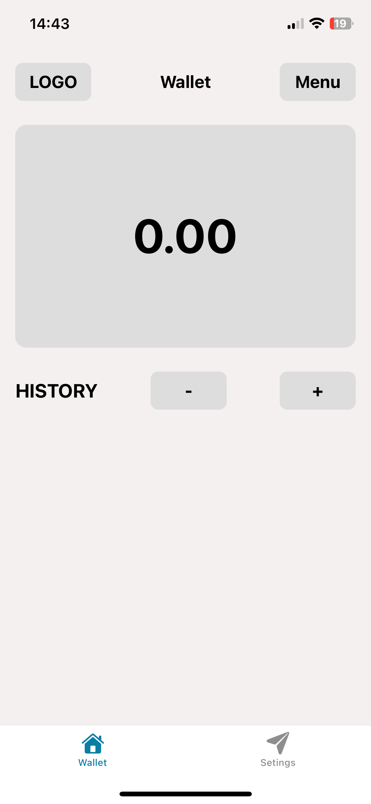
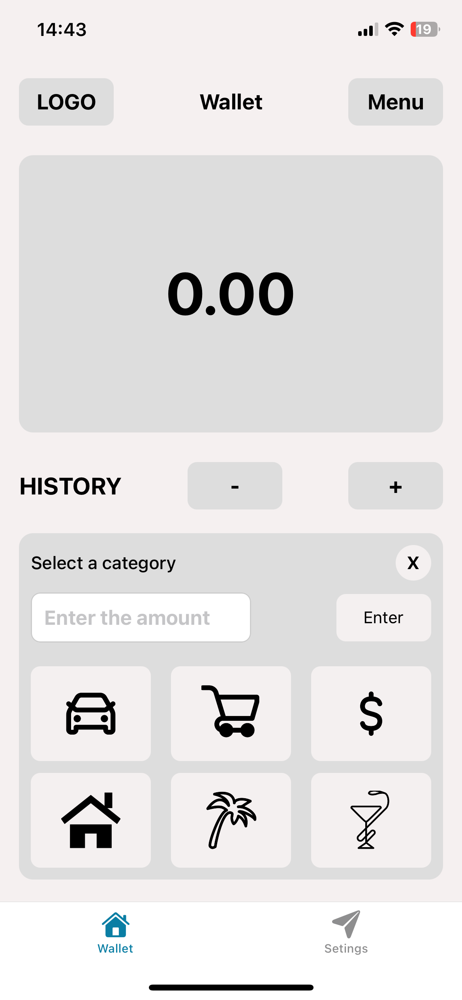
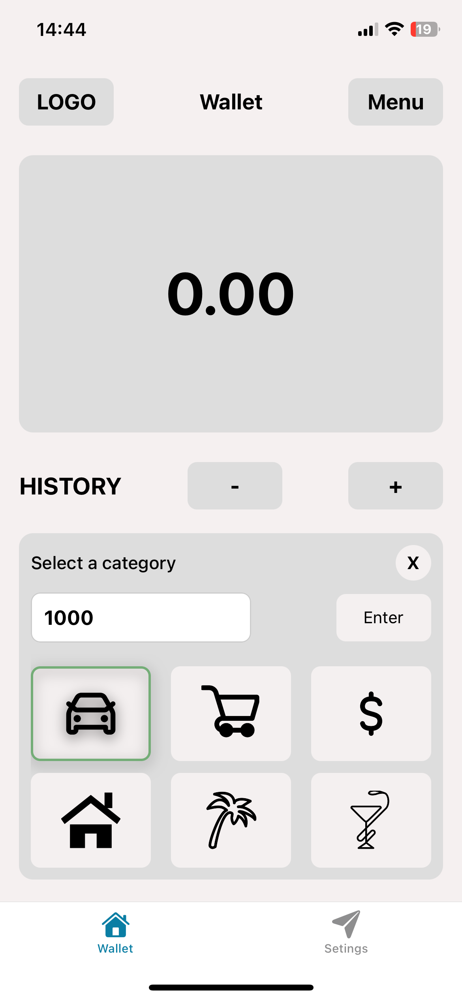
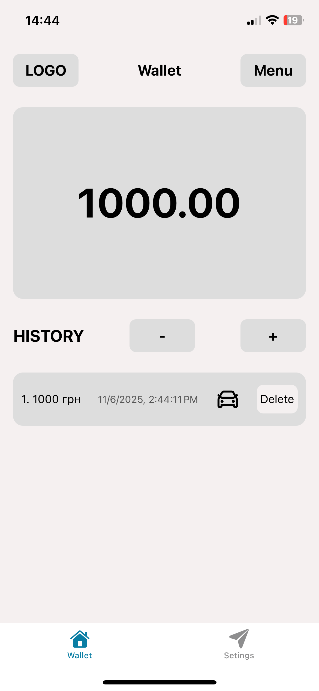
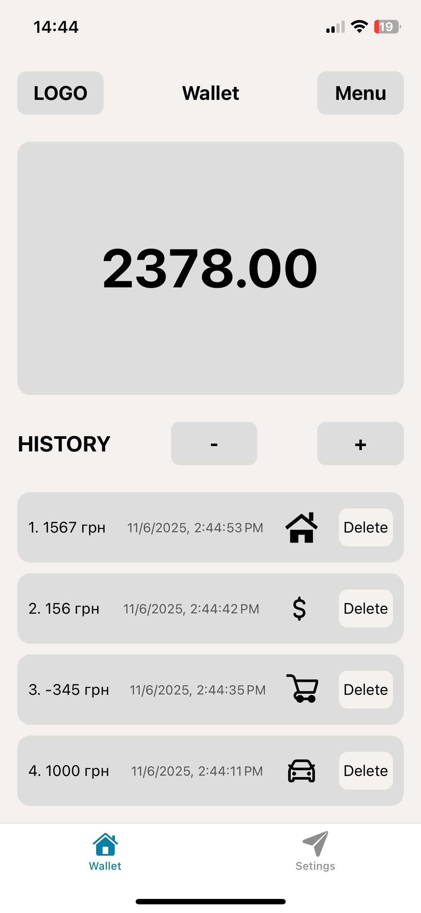

Окей 👍 Ось приклад готового **README.md** для твого React Native / Expo застосунку (можеш вставити прямо у файл `README.md` у корені проєкту):

---

# 💸 Finance Tracker App

Мобільний застосунок для відстеження витрат.
Реалізовано на **React Native + Expo**.

## 📱 Скриншот застосунку







## 🚀 Як запустити проєкт

### 1️⃣ Клонуй репозиторій

```bash
git clone https://github.com/kadetov18/Wallet-menager.git
cd Wallet-menager
```

### 2️⃣ Встанови залежності

```bash
npm install
```

### 3️⃣ Запусти проєкт

```bash
npx expo start
```

### 4️⃣ Відкрий у телефоні

1. Встанови застосунок **Expo Go** з App Store / Google Play.
2. Відскануй QR-код, який зʼявиться в терміналі або у вікні браузера.
3. Насолоджуйся 🚀

---

## ⚙️ Технології

- **React Native**
- **Expo**
- **TypeScript**
- **React Hooks**
- **AsyncStorage** (якщо є)
- **Custom Components** (Curtain, History, Balance і т.д.)

---

## 📂 Структура проєкту

```
src/
 ├── components/
 │   ├── Balance/
 │   ├── Curtain/
 │   └── History/
 ├── App.tsx
 └── styles/
```

---

## 🧾 Функціонал

- Додавання витрат
- Вибір категорії
- Відображення історії витрат
- Видалення картки з історії
- Збереження даних між сесіями (опціонально)

---
